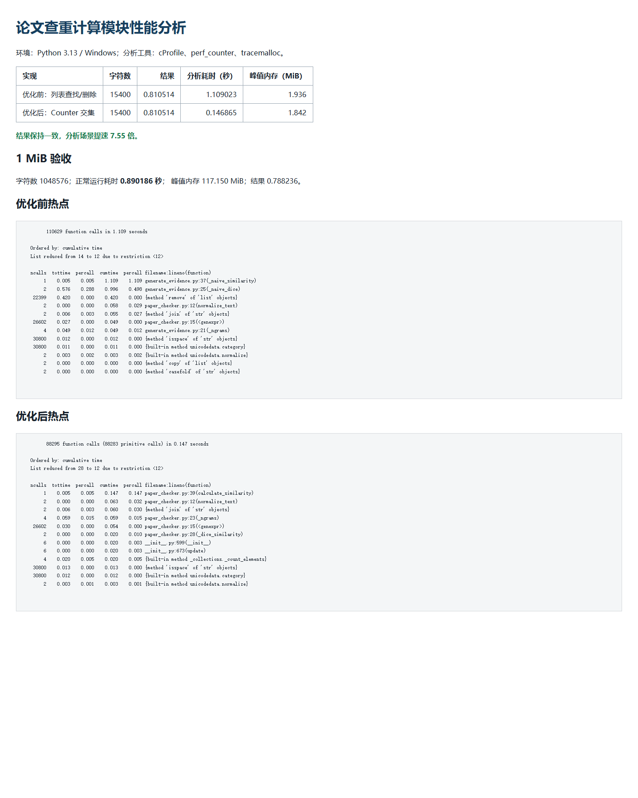

# 计算模块性能分析

## 方法

分析环境为 Windows、Python 3.13，使用 Python 标准库中的 `cProfile`、`time.perf_counter` 和 `tracemalloc`。`tools/generate_evidence.py` 可以重新生成原始数据、热点列表和报告页面。

优化前后使用完全相同的规范化、n-gram、Dice 公式和权重，区别仅在多重集交集的实现：

- 优化前：在列表中逐项查找并删除匹配项，最坏时间复杂度为 O(n²)。
- 优化后：分别建立 `Counter`，通过计数器交集累计公共片段，时间复杂度为 O(n)。

## 结果

15,400 字符分析样本：

| 实现 | 相似度 | cProfile + tracemalloc 耗时 | 峰值内存 |
| --- | ---: | ---: | ---: |
| 优化前：列表查找/删除 | 0.810514 | 1.109023 秒 | 1.936 MiB |
| 优化后：Counter 交集 | 0.810514 | 0.146865 秒 | 1.842 MiB |

相似度完全一致，分析场景提速 7.55 倍。优化前 `_naive_dice` 与 `list.remove` 是主要热点；优化后热点转移到必要的文本规范化和 n-gram 构造。

1 MiB 输入验收：

| 字符数 | 相似度 | 正常运行耗时 | 诊断峰值内存 |
| ---: | ---: | ---: | ---: |
| 1,048,576 | 0.788236 | 0.890186 秒 | 117.150 MiB |

正常耗时低于5秒，内存显著低于2048 MB。峰值内存在单独启用 `tracemalloc` 的诊断运行中取得，避免把逐对象跟踪开销误记为用户正常运行耗时。

## 性能分析截图

原始数据保存在 `reports/evidence/performance.json`，完整热点输出保存在同目录的 `cprofile-before.txt` 和 `cprofile-after.txt`。

