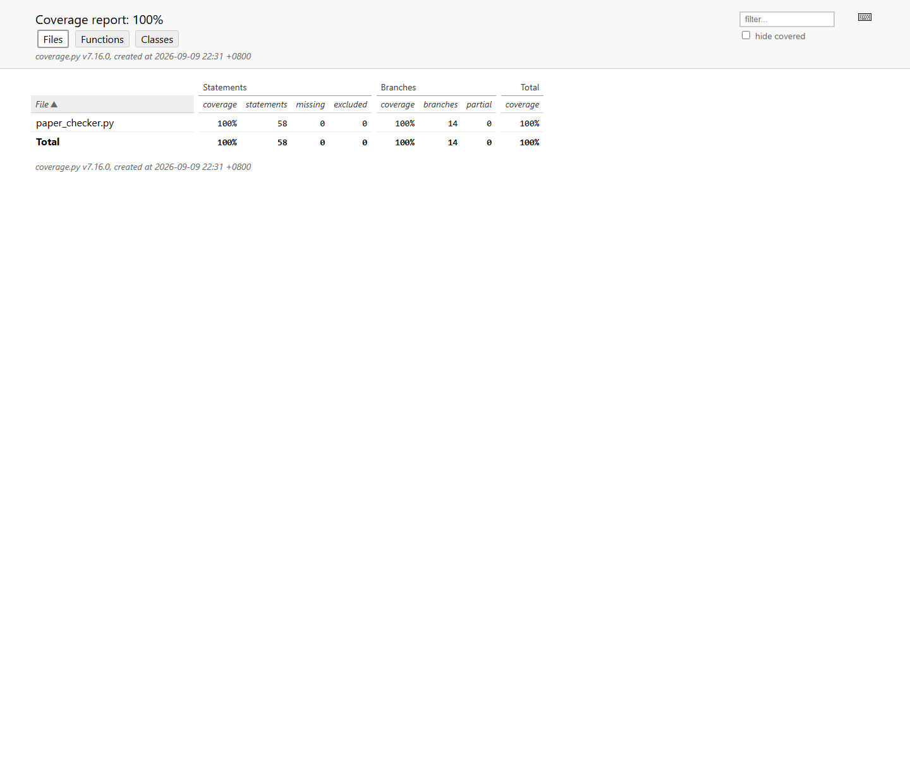

# 单元测试与覆盖率报告

## 测试策略

测试采用 Python 标准库 `unittest`，既包含面向需求的黑盒测试，也根据条件分支设计白盒用例：

- 规范化分支：全角/半角、大小写、空白、标点、符号、中文和数字。
- 相似度分支：双空、单边空、单字符退化、普通一元组/二元组加权。
- 多重集逻辑：重复字符和段落重排，验证计数交集而非集合交集。
- 编码分支：UTF-8 BOM 直接解码、GB18030 回退和两种编码均失败。
- 命令行分支：成功、参数错误、输入不存在、输出不可写和 `argv=None`。
- 文件安全：先读后写，覆盖输入路径时仍使用写入前内容完成计算。
- 端到端：以独立 Python 进程执行 `main.py`，验证退出码、超时和答案格式。

共 20 个测试方法，覆盖的主要场景超过需求规定的10个测试用例。

## 执行结果

```text
Ran 20 tests in 0.092s
OK
```

```text
Name               Stmts   Miss Branch BrPart  Cover
----------------------------------------------------
paper_checker.py      58      0     14      0   100%
----------------------------------------------------
TOTAL                 58      0     14      0   100%
```

核心模块语句覆盖率 100%，分支覆盖率 100%，超过计划中的 90% 目标。



## 异常用例与设计目标

| 异常场景 | 测试方法 | 设计目标 |
| --- | --- | --- |
| 参数数量错误 | `test_main_rejects_wrong_argument_count` | 显示用法并返回2，不访问文件 |
| 输入文件不存在 | `test_main_reports_missing_input_without_traceback` | 返回1且不输出 traceback |
| 文件无法解码 | `test_main_reports_invalid_encoding` | 明确提示支持的编码并返回1 |
| 输出目录不存在 | `test_main_reports_unwritable_output_location` | 捕获写入错误并返回1 |
| 输出覆盖输入 | `test_output_may_overwrite_an_input_after_both_are_read` | 先读取两篇文本，再写答案 |

## 运行命令

```powershell
python -m unittest discover -v
python -m coverage run --branch -m unittest discover
python -m coverage report -m
python -m coverage html
```

